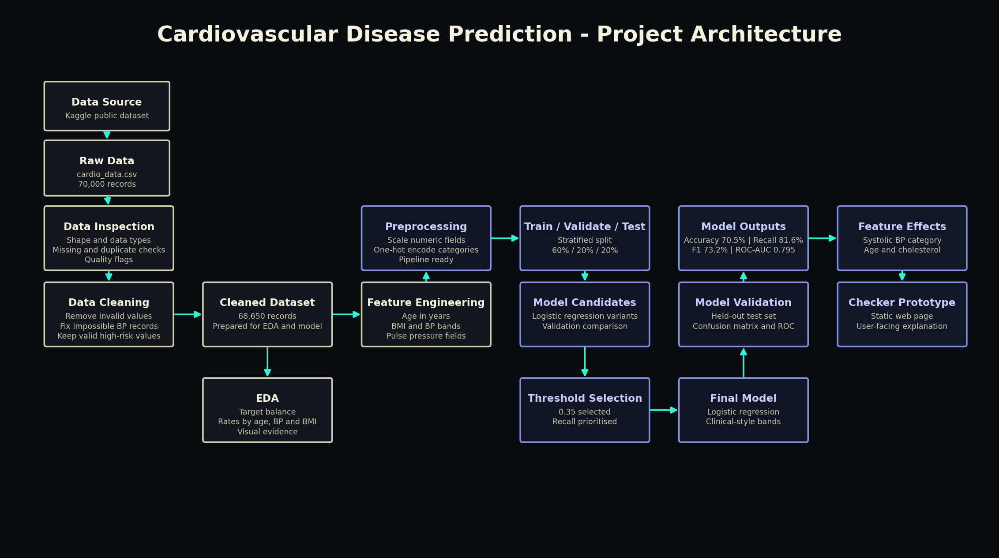
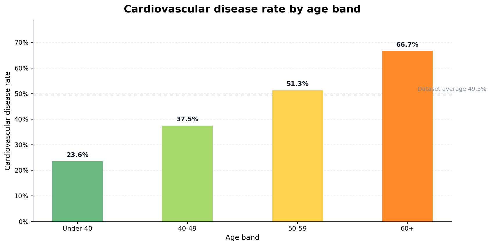
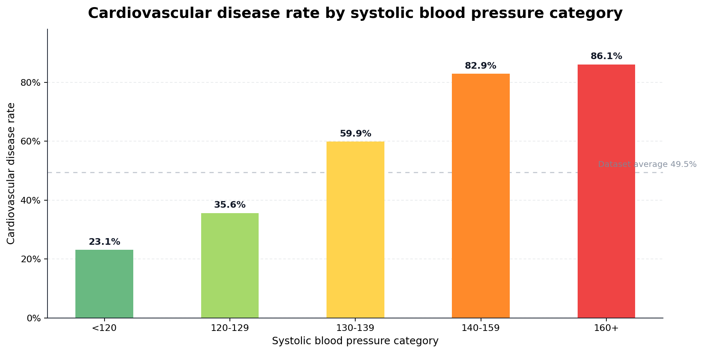
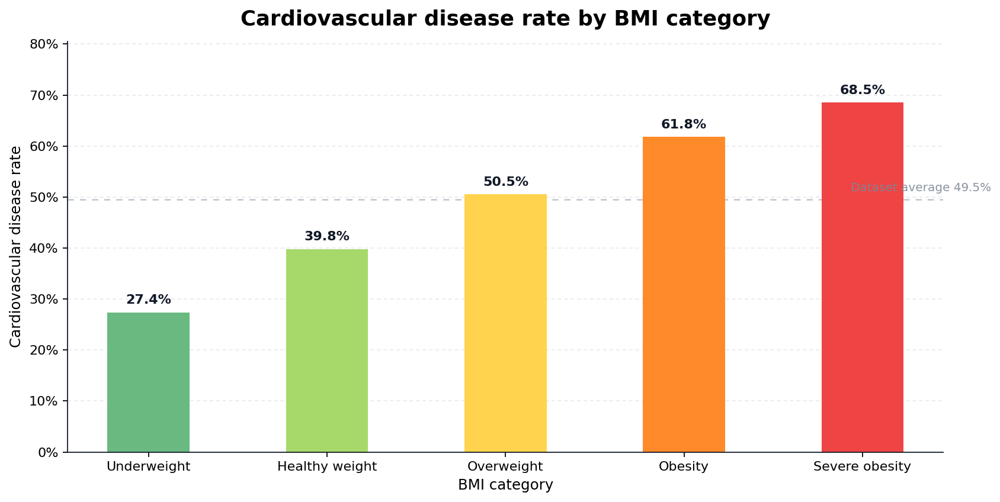
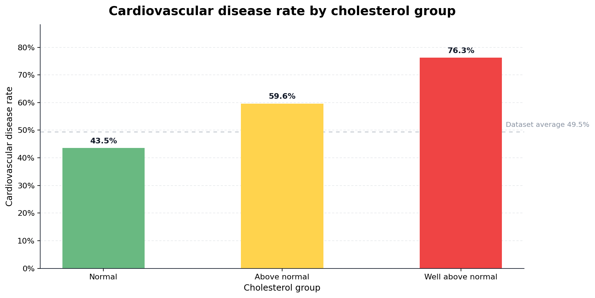
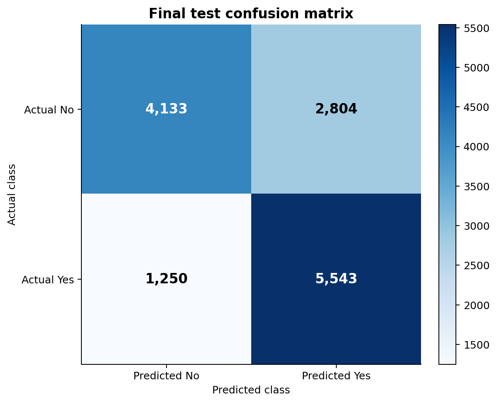
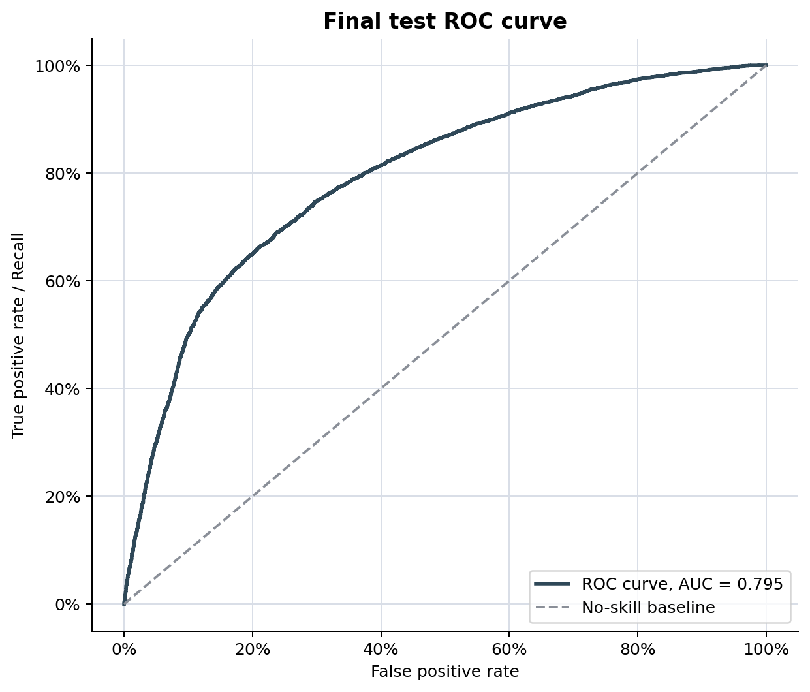
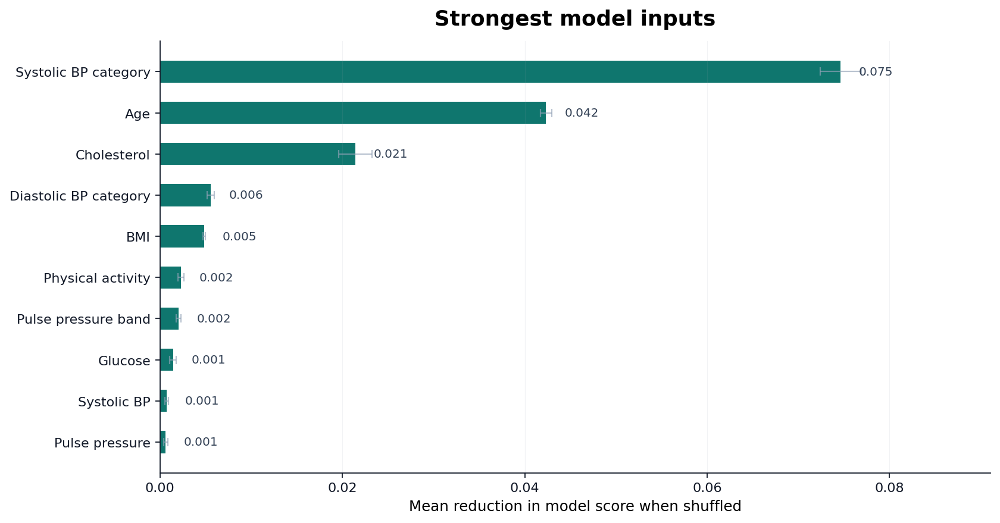

# Predicting Cardiovascular Disease from Routine Health Indicators

## Executive Summary

This project uses a public cardiovascular disease dataset to predict whether cardiovascular disease is recorded for an individual profile. The target variable is `cardio`, where `1` means cardiovascular disease is present in the dataset and `0` means it is not present.

The model uses routine health indicators including age, height, weight, blood pressure, cholesterol, glucose, smoking, alcohol intake and physical activity. Logistic regression was selected because the target is binary, the method is interpretable, and the output can be explained as a predicted probability.

The final model achieved the following results on the held-out test set.

| Metric | Final test result | Meaning |
| --- | ---: | --- |
| Accuracy | 70.5% | The model correctly classified about seven in ten test records. |
| Precision | 66.4% | Around two-thirds of positive predictions were positive in the dataset. |
| Recall | 81.6% | The model identified most records where cardiovascular disease was present. |
| F1 score | 73.2% | The model achieved a reasonable balance between precision and recall. |
| ROC-AUC | 0.795 | The model had useful ranking ability across probability thresholds. |

A local risk checker was also created to show how the model output could be communicated to a non-technical user. It presents an estimated probability, a risk flag and simple visual explanations. The checker is a prototype for communication and learning. It does not diagnose cardiovascular disease or replace medical advice.

## Problem Statement

Cardiovascular disease is linked with routine health indicators such as age, blood pressure, cholesterol, body weight and lifestyle factors. This project explores whether those indicators can be used to predict cardiovascular disease status in a structured dataset.

The practical purpose is to demonstrate a full data science workflow:

1. Prepare a public dataset for modelling.
2. Explore health indicators using EDA.
3. Build an interpretable binary classification model.
4. Evaluate the model using suitable classification metrics.
5. Explain false positives and false negatives.
6. Communicate the result responsibly through a prototype checker.

The use case is non-diagnostic risk awareness. Recall is important because a false negative means a record with cardiovascular disease is not flagged by the model. A false positive is still a limitation, but it is less serious for an awareness prototype than missing a likely positive record.

## Research Question and Hypothesis

**Research question:** how effectively can routinely recorded health indicators predict cardiovascular disease status for a non-diagnostic risk-awareness use case, and which indicators provide the clearest predictive signal?

**Hypothesis:** routine health indicators, particularly age, blood pressure, cholesterol and BMI, will provide measurable predictive value for cardiovascular disease status. Logistic regression is expected to perform above a simple majority-class baseline across accuracy, recall, F1 score and ROC-AUC.

## Research Process and Context

Cardiovascular disease risk is linked with routine indicators such as age, high blood pressure, cholesterol, weight-related factors, smoking, alcohol intake and physical inactivity. Existing cardiovascular risk models also show that routine measurements can be combined to estimate risk, but they need calibration and external validation before use in real populations.

This project therefore uses clinically recognisable variables and an interpretable model, but treats the output as a learning and communication prototype because the Kaggle dataset has not been clinically validated for UK populations.

## Data Source

Dataset: **Cardiovascular Disease Dataset**  
Publisher: Kaggle dataset page by Sulianova  
Source link: <https://www.kaggle.com/datasets/sulianova/cardiovascular-disease-dataset>

The raw dataset contains:

| Item | Value |
| --- | ---: |
| Raw records | 70,000 |
| Raw columns | 13 |
| Target variable | `cardio` |
| Target type | Binary classification |
| Positive class | Cardiovascular disease present |

The dataset was suitable because it has a clear binary target and enough records for training, validation and testing. It also contains health indicators that can be explained clearly to a general audience.

The raw fields include:

| Field | Meaning |
| --- | --- |
| `age` | Age stored in days |
| `gender` | Coded gender field |
| `height` | Height in centimetres |
| `weight` | Weight in kilograms |
| `ap_hi` | Systolic blood pressure |
| `ap_lo` | Diastolic blood pressure |
| `cholesterol` | Cholesterol category |
| `gluc` | Glucose category |
| `smoke` | Smoking indicator |
| `alco` | Alcohol intake indicator |
| `active` | Physical activity indicator |
| `cardio` | Cardiovascular disease target |

The Kaggle page did not provide a confirmed licence or DOI at the time of review. For that reason, the dataset is treated as suitable for cautious academic and portfolio use, but the raw dataset should be accessed through Kaggle rather than redistributed from a public repository.

## Project Workflow

The project follows a local-first workflow. Each stage creates outputs that can be reviewed before moving to the next stage.



The workflow was:

1. **Inspect the raw dataset.** The raw Kaggle CSV was loaded, the delimiter was confirmed and the row count, column count, data types and target distribution were checked.
2. **Check data quality.** The notebooks checked missing values, duplicates, impossible measurements and target balance.
3. **Clean and prepare the data.** Serious measurement-quality issues were removed, medically possible high-risk records were kept, and age, BMI and blood-pressure features were created.
4. **Explore the cleaned data.** Cardiovascular disease rates were compared across age, blood pressure, BMI, cholesterol, glucose and activity groups.
5. **Build logistic regression models.** The data was split into training, validation and test sets, then candidate feature sets were compared using the same algorithm.
6. **Interpret model performance.** Accuracy, precision, recall, F1 score, confusion matrix and ROC-AUC were used to explain performance and the main error trade-off.
7. **Create a prototype output.** The selected model specification was exported into a local static checker built with HTML, CSS and JavaScript.

## Data Infrastructure and Tools

The project used a local-first workflow so each stage could be checked before publication. Raw data, processed data, notebooks, charts, tables and the checker prototype were stored separately.

| Tool | Use in the project |
| --- | --- |
| Python | Data preparation, feature engineering, modelling and evaluation |
| Jupyter notebooks | Step-by-step inspection, cleaning, EDA and modelling evidence |
| pandas and NumPy | Tabular data handling and derived feature creation |
| Matplotlib and seaborn | Charts for EDA and model evaluation |
| scikit-learn | Logistic regression pipeline, train/validation/test split and metrics |
| HTML, CSS and JavaScript | Static checker prototype that can run without a backend |

Excel would have been suitable for early inspection, but not for repeatable modelling. Power BI would have been suitable for dashboarding, but not for training the model. Logistic regression in scikit-learn was selected because the task was binary classification and interpretability was important.

## Data Engineering and Preparation

### Step 1: Raw Inspection

The first notebook is read-only:

`02_notebooks/01_dataset_read_only_inspection.ipynb`

It checks the dataset before any cleaning or modelling takes place. This creates a clear starting point and avoids making assumptions about the data.

```python
raw_path = PROJECT_DIR / "01_data" / "raw" / "cardio_data.csv"
raw_df = pd.read_csv(raw_path, sep=";")

raw_shape = raw_df.shape
missing_values = raw_df.isna().sum()
target_balance = raw_df["cardio"].value_counts(normalize=True)
```

This code loads the source file using the correct delimiter, checks the dataset shape, counts missing values and confirms the target balance before any records are changed.

The inspection confirmed:

1. The raw dataset has 70,000 records.
2. The file uses a semicolon delimiter.
3. The target variable is binary.
4. The target is close to balanced.
5. There are no missing values in the raw fields.
6. Some measurement values need cleaning before modelling.

The target balance before cleaning was:

| Target value | Meaning | Share before cleaning |
| --- | --- | ---: |
| `0` | Cardiovascular disease not present | 50.0% |
| `1` | Cardiovascular disease present | 50.0% |

### Step 2: Cleaning Rules

The second notebook prepares the dataset:

`02_notebooks/02_data_cleaning_and_eda.ipynb`

The cleaning rules removed values that were unsuitable for a cardiovascular prediction model. The rules were designed to remove impossible or logically invalid measurements while keeping medically possible high-risk records.

This decision was important because high-risk values can be genuine in health data. Removing them automatically could weaken the model and hide the profiles the project is trying to identify.

```python
work_df = raw_df.copy()

quality_flags = pd.DataFrame(index=work_df.index)
quality_flags["systolic_bp_out_of_range"] = ~work_df["ap_hi"].between(50, 300)
quality_flags["diastolic_bp_out_of_range"] = ~work_df["ap_lo"].between(30, 200)
quality_flags["systolic_less_than_diastolic"] = work_df["ap_hi"] < work_df["ap_lo"]
quality_flags["any_quality_issue"] = quality_flags.any(axis=1)

clean_df = work_df.loc[~quality_flags["any_quality_issue"]].copy()
```

This code makes the cleaning repeatable because each removed record is linked to a defined quality rule rather than being removed manually.

Cleaning summary:

| Stage | Records |
| --- | ---: |
| Raw data | 70,000 |
| After quality-rule cleaning | 68,650 |
| Records removed | 1,350 |

The cleaned target balance remained close to the original:

| Target value | Share after cleaning |
| --- | ---: |
| `0` | 50.5% |
| `1` | 49.5% |

### Step 3: Feature Engineering

The project created interpretable features to support modelling and communication.

```python
clean_df = clean_df.rename(columns={
    "age": "age_days",
    "height": "height_cm",
    "weight": "weight_kg",
})

clean_df["age_years"] = clean_df["age_days"] / 365.25
clean_df["bmi"] = clean_df["weight_kg"] / ((clean_df["height_cm"] / 100) ** 2)
clean_df["pulse_pressure"] = clean_df["ap_hi"] - clean_df["ap_lo"]
clean_df["mean_arterial_pressure"] = (
    clean_df["ap_lo"] + clean_df["pulse_pressure"] / 3
)
```

This code turns raw measurements into health indicators that are easier to explain and can be reused consistently in EDA, modelling and the checker.

Key engineered fields:

| Field | Purpose |
| --- | --- |
| `age_years` | Converts age from days into a readable age value |
| `age_band` | Groups ages for EDA and explanation |
| `bmi` | Uses height and weight to create a recognised health indicator |
| `bmi_category` | Groups BMI values for comparison |
| `pulse_pressure` | Measures the difference between systolic and diastolic blood pressure |
| `mean_arterial_pressure` | Adds a derived blood-pressure indicator |
| `systolic_bp_category` | Groups systolic blood pressure into readable ranges |
| `diastolic_bp_category` | Groups diastolic blood pressure into readable ranges |
| `pulse_pressure_band` | Groups pulse pressure for checker explanations |

The `id` field was excluded from modelling because it is an identifier and does not describe health status.

## Data Visualisation and Exploratory Analysis

EDA was used to understand how cardiovascular disease rates changed across key health indicators. The charts below show the clearest patterns used to shape the model and the checker explanation.

```python
age_rate_table = (
    clean_df_out
    .groupby("age_band", observed=True)["cardio"]
    .agg(records="size", cardiovascular_disease_rate="mean")
    .reset_index()
)
```

This code calculates the disease rate within each age band. The same grouped-rate approach was used for blood pressure, BMI, cholesterol, glucose and activity so the charts came from repeatable summaries rather than manual counting.

### Age

Older age bands showed higher observed cardiovascular disease rates.



Age was expected to be one of the strongest predictors.

### Systolic Blood Pressure

Systolic blood pressure showed one of the clearest relationships with cardiovascular disease rate.



This pattern supported the use of blood-pressure categories in the model and in the checker explanation.

### BMI

BMI helped explain differences in observed cardiovascular disease rates across weight categories.



BMI was used as a model feature and an explanatory grouping. It was not used as a deletion rule by itself.

### Cholesterol

Cholesterol categories showed a clear pattern in the cleaned dataset.



This supported the decision to include cholesterol as a routine health indicator in the model.

### EDA Summary

The strongest EDA signals were:

1. Age band.
2. Systolic blood pressure category.
3. Cholesterol category.
4. Diastolic blood pressure category.
5. BMI.

The EDA showed predictive patterns in the dataset. It did not prove that any single indicator causes cardiovascular disease.

## Data Analytics and Modelling

The modelling notebook is:

`02_notebooks/03_logistic_regression_model.ipynb`

The analytical task was binary classification.

| Item | Value |
| --- | --- |
| Target | `cardio` |
| Positive class | Cardiovascular disease present |
| Algorithm | Logistic regression |
| Selected model | Clinical-style bands with routine indicators |
| Selected threshold | 0.35 |

```python
preprocessor = ColumnTransformer(
    transformers=[
        ("numeric", Pipeline(numeric_steps), numeric_features),
        ("categorical", make_one_hot_encoder(), categorical_features),
    ],
    remainder="drop",
)

model = Pipeline([
    ("preprocess", preprocessor),
    ("model", LogisticRegression(max_iter=4000, solver="lbfgs")),
])
```

This code keeps preprocessing and logistic regression in one repeatable pipeline, which reduces the risk of applying different transformations during training and testing.

### Why Logistic Regression Was Used

Logistic regression was selected because:

1. The target is binary.
2. The output can be interpreted as a probability.
3. Probability thresholds can be adjusted.
4. The method is easier to explain than many complex models.
5. It provides a transparent classification baseline.

A simpler, interpretable model was selected because the result needed to be understandable as well as useful.

### Train, Validation and Test Split

The cleaned data was split into three parts.

| Split | Records | Cardiovascular disease rate |
| --- | ---: | ---: |
| Train | 41,190 | 49.5% |
| Validation | 13,730 | 49.5% |
| Test | 13,730 | 49.5% |

The training set was used to fit model candidates. The validation set was used to compare candidates and select the operating threshold. The test set was held back until the end so final performance could be measured on unseen data.

### Candidate Models

All candidate models used logistic regression. The comparison tested different feature representations while keeping the algorithm consistent.

| Candidate | Description |
| --- | --- |
| `baseline_original` | Original routine indicators with numeric scaling |
| `clinical_numeric` | Engineered continuous clinical indicators plus coded risk fields |
| `clinical_bands` | Continuous indicators plus interpretable clinical-style bands |
| `clinical_bands_numeric_interactions` | Clinical bands plus second-order numeric terms |

The selected model was `clinical_bands`. It gave a strong balance of performance and interpretability.

### Threshold Selection

The final operating threshold was set to `0.35`.

A threshold is the point where the model changes from predicting `no cardiovascular disease` to predicting `cardiovascular disease`.

The project selected `0.35` because recall was prioritised for the risk-awareness use case. A false negative means the model predicts no cardiovascular disease when cardiovascular disease is present. A false positive means the model predicts cardiovascular disease when it is not present.

The false negative is the more serious error because it misses a likely positive record. The model accepts more false positives so it can identify more positive cases.

```python
probabilities = model.predict_proba(X_test)[:, 1]
predictions = (probabilities >= selected_threshold).astype(int)

tn, fp, fn, tp = confusion_matrix(y_test, predictions).ravel()
recall = recall_score(y_test, predictions)
roc_auc = roc_auc_score(y_test, probabilities)
```

This code applies the selected threshold and calculates the evidence used to judge model performance, including false negatives, recall and ROC-AUC.

## Results

### Final Test Metrics

The final model was evaluated once on the held-out test set.

| Metric | Result | Interpretation |
| --- | ---: | --- |
| Accuracy | 70.5% | Overall correct classification rate |
| Precision | 66.4% | How reliable a positive flag was |
| Recall | 81.6% | How many positive records were identified |
| F1 score | 73.2% | Balance between precision and recall |
| ROC-AUC | 0.795 | Ability to rank positive cases above negative cases |

The model performed meaningfully above a simple majority-class baseline. The result is suitable for a learning and awareness prototype, not for clinical use.

Stratified three-fold cross-validation gave a mean ROC-AUC of 0.795, which was close to the final test ROC-AUC. The Brier score was 0.184, giving a basic check of probability error. Formal confidence intervals and a full calibration curve were not completed, so the checker percentage should be read as an approximate risk estimate rather than a clinically reliable probability.

### Confusion Matrix

|  | Predicted: No cardiovascular disease | Predicted: Cardiovascular disease |
| --- | ---: | ---: |
| Actual: No cardiovascular disease | 4,133 | 2,804 |
| Actual: Cardiovascular disease | 1,250 | 5,543 |



The model identified 5,543 positive records and missed 1,250 positive records. It also incorrectly flagged 2,804 negative records.

This trade-off matches the project use case because recall is stronger than precision.

### ROC Curve



ROC-AUC was `0.795`. This shows useful ranking performance. A value near `0.5` would suggest little better than random ranking. A value close to `1.0` would suggest near-perfect separation.

### Strongest Model Inputs

The model-input ranking shows which fields contributed most to predictive performance.



Top five model inputs:

| Rank | Feature |
| ---: | --- |
| 1 | Systolic blood pressure category |
| 2 | Age |
| 3 | Cholesterol |
| 4 | Diastolic blood pressure category |
| 5 | BMI |

These inputs are clinically recognisable and easy to explain, which supports the choice of an interpretable model.

## Prototype Risk Checker

The local checker is stored in:

`05_app/index.html`

The checker allows a user to enter routine health details and view:

1. Estimated risk percentage.
2. Risk flag.
3. BMI.
4. Blood pressure band.
5. Pulse pressure.
6. Plain-English explanation.
7. Simple visual comparisons.

The checker does not show technical model metrics in the user interface. Metrics such as precision, recall, confusion matrix and ROC-AUC remain in the modelling evidence, where they can be interpreted properly.

The checker is a communication prototype. It shows one way to present a model output clearly and responsibly to a non-technical user. It is not a diagnostic tool and should not be used for medical decisions.

## Recommendations

The project supports the following recommendations:

1. Keep the model as a learning and awareness prototype only.
2. Use logistic regression as the main model because it is transparent and suitable for explaining binary prediction.
3. Prioritise recall for this use case because missed positive records are more serious than false flags.
4. Keep the checker clearly separate from clinical advice or diagnosis.
5. Use a dataset with clearer licensing and stronger metadata before any wider publication or deployment.
6. Review calibration before treating probability values as reliable risk estimates.
7. Create a model card before publication, covering intended use, non-intended use, metrics, risks and limitations.
8. Test the checker wording with users to reduce the risk of misunderstanding.

## Limitations

The model should be interpreted carefully.

Key limitations:

1. The dataset supports prediction and association, not causation.
2. The dataset source does not confirm population origin strongly enough for UK clinical generalisation.
3. The dataset licence was listed as unknown, so reuse must be handled cautiously.
4. The model is not clinically validated.
5. The model should not be used for diagnosis, treatment, clinical screening decisions or healthcare prioritisation.
6. Logistic regression assumes a suitable relationship between inputs and the log-odds of the outcome.
7. Some health indicators are correlated, especially blood-pressure and weight-related variables.
8. Gender coding was not translated into male or female labels because the mapping was not confirmed in the project notes.
9. Smoking and alcohol required cautious interpretation because fitted relationships in the dataset were not clinically intuitive.
10. Users may focus on the percentage and ignore the caveat.

The main limitation is that the model may work within this dataset but fail to generalise to real clinical populations.

## Ethics, Governance and Responsible Use

The project uses public data, but the topic is health-related. Responsible handling is important even though the work is local and educational.

Governance decisions made in the project:

1. The raw dataset was kept unchanged.
2. Processed outputs were stored separately.
3. Cleaning decisions were documented in notebooks.
4. The identifier field was excluded from modelling.
5. Outputs avoid individual-level record display.
6. The checker includes non-diagnostic wording.
7. The model is described as a prototype, not a medical product.

Ethical considerations:

1. Users may overtrust a probability percentage.
2. The dataset may contain bias from its original collection context.
3. The model may not generalise to different populations.
4. False negatives are more serious than false positives for risk awareness.
5. A real system would require clinical governance, privacy controls, accessibility testing and monitoring.

Responsible use statement:

This project demonstrates a data science workflow and model communication. It should not be used to assess an individual person's health or replace advice from a qualified healthcare professional.

## How to Run This Project

If using a public clone of this project, download the Kaggle dataset from the source link above and place the CSV at:

```text
01_data/raw/cardio_data.csv
```

Then run:

```bash
cd project_1_cardiovascular_disease
pip install pandas numpy matplotlib seaborn scikit-learn jupyter
```

Run the notebooks in order:

| Order | Notebook | Purpose |
| ---: | --- | --- |
| 1 | `02_notebooks/01_dataset_read_only_inspection.ipynb` | Inspect the raw dataset without changing it |
| 2 | `02_notebooks/02_data_cleaning_and_eda.ipynb` | Clean the data, engineer features and create EDA outputs |
| 3 | `02_notebooks/03_logistic_regression_model.ipynb` | Train, select and evaluate the logistic regression model |

The notebooks create charts and tables in `04_outputs/`.

The optional helper scripts below recreate project visuals and export the web model specification.

```bash
python 03_src/create_project_visuals.py
python 03_src/export_web_model_spec.py
```

Open `05_app/index.html` to view the local checker. It is a static HTML, CSS and JavaScript prototype, so it does not require a backend server.

## Key Sources

Dataset: Sulianova, A. (2019) *Cardiovascular Disease Dataset*, Kaggle. <https://www.kaggle.com/datasets/sulianova/cardiovascular-disease-dataset>

Cardiovascular risk context: NHS (2026) *Cardiovascular disease*. <https://www.nhs.uk/conditions/cardiovascular-disease/>

Risk model context: D'Agostino et al. (2008), Hippisley-Cox et al. (2017) and SCORE2 Working Group (2021).

Logistic regression method: Hosmer, Lemeshow and Sturdivant (2013), *Applied Logistic Regression*.

Python modelling library: Pedregosa et al. (2011), *Scikit-learn: Machine Learning in Python*, and scikit-learn documentation.

Responsible data use: Information Commissioner's Office guidance on data protection principles and AI.
